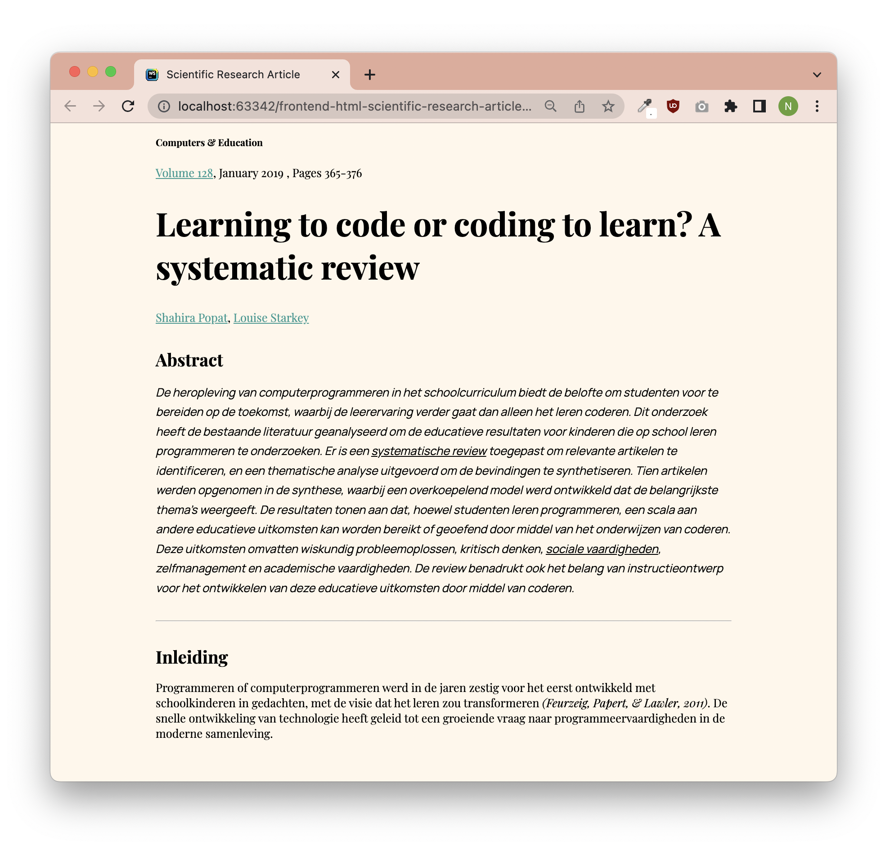

# Opdrachtbeschrijving

## Inleiding

Onlangs is er onderzoek gedaan naar de voordelen die leren programmeren heeft op andere facetten van onderwijs. Deze
onderzoeksresultaten zijn gepubliceerd in het bekende academische blad Elsevier, maar deze organisatie is de code
kwijtgeraakt!
Gelukkig weet jij inmiddels voldoende van HTML om deze pagina voor hen te publiceren!


<sub>_Let op:_ dit screenshot bevat CSS-styling</sub>

## Opdracht 1 - Onderzoek

Bijgevoegd vindt je een lijst met HTML-elementen die je wellicht nog nooit hebt gezien. En dat is ook niet zo gek, want
er bestaan er wel _honderden_! Daarom ga je eerst op onderzoek uit. Loop de lijst met elementen één voor één langs en
zoek
een werkend voorbeeld op [MDN Webdocs](https://developer.mozilla.org/en-US/) om te zien hoe het element toegepast moet
worden. Pak vervolgens het [eindresultaat mét
styling](https://github.com/hogeschoolnovi/frontend-html-research-article/blob/main/assets/screenshots/screenshot_eindresultaat_met_styling.png)
erbij om te kijken op welke plekken je dit element zou kunnen toepassen en noteer dit.

```html

<aside>
<main>
<article>
<section>
<sub>
<hr>
<time>
<pre>
<abbr>
<blockquote>
<cite>
<caption>
<code>
<figure>
<samp>
<fieldset>
<video>
```

## Opdracht 2 - Bouwen

Hoewel het eindresultaat inclusief styling er prachtig uitziet, zullen we eerst een stapje terug moeten doen.
Je gaat het wetenschappelijke artikel namaken in HTML, zodat deze er exact zo uitziet als
het [eindresultaat **zonder** styling](https://github.com/hogeschoolnovi/frontend-html-research-article/blob/main/assets/screenshots/screenshot_eindresultaat_zonder_styling.png).
Ja, dit ziet er inderdaad uit alsof 'ie gemaakt is in 1998. Dat zullen we even moeten accepteren. Houdt rekening met het volgende:

* Je mag **alleen HTML gebruiken** (dus geen CSS!);
* In dit project staat al een leeg HTML-document waarin je kunt werken: `index.html`. Je hoeft dus zelf geen nieuwe
  bestanden aan te
  maken;
* Al het beeldmateriaal kun je terugvinden in de map `assets`;
* Je mag de bestanden niet verplaatsen;
* Je bent hier niet om jouw typediploma te halen, dus alle tekst die je nodig hebt voor de pagina kun je [onderaan de
  opdrachtbeschrijving](#tekst) terugvinden;

### Stappenplan

1. Zorg ervoor dat er "Scientific Research Article" in het tabblad komt te staan.
2. Gebruik semantische elementen om het artikel in te delen in duidelijke gebieden. Let hierbij goed op welke
   heading-tags je gebruikt (`<h1>`, `<h2>`, `<h3>`, `<h4>` etc.) en voeg de tekst in op de juiste plaatsen.
3. Kijk goed naar de inhoud van de tekst om te ontdekken welke bijzonderheden daarin staan. Denk bijvoorbeeld aan het
   gebruik
   van `<strong>`, `<em>`, `<time>`, `<cite>`, `<blockquote>`, `<code>`, `<samp>` en `<sub>`.
4. Voeg alle links in op de juiste plekken en zorg dat deze worden geopend in een nieuw tabblad:
    - Volume 128: _https://www.sciencedirect.com/journal/computers-and-education/vol/128/suppl/C_
    - Auteur-profiel Shahira: _https://www.scopus.com/authid/detail.uri?authorId=57204187244_
    - Auteur-profiel Louise: _https://www.scopus.com/authid/detail.uri?authorId=25121914800_
    - PubMed: _https://pubmed.ncbi.nlm.nih.gov/_
    - Education Source: _https://www.ebsco.com/products/research-databases/education-source_
    - ERIC: _https://eric.ed.gov/_
    - EdHub: _https://edhub.novi.nl/_
5. Richt je nu op de afbeeldingen. Deze moeten allemaal worden voorzien van een begeleidende tekst _("Figuur x:
   uitleg")_ en staan een stukje van de rand af... Welke speciale HTML-elementen kun je hiervoor gebruiken?
6. Voeg de video `multimedia_preview_edhub.mov` in: deze is van het type `video/mp4`. We willen graag dat knopjes van de
   videoplayer zichtbaar zijn. Zorg je er ook voor dat de video het plaatje `placeholder_video.png` weergeeft als de
   video niet wordt afgespeeld? Dit noem je een _thumbnail_.
7. Richt de tabel in en houdt er rekening mee dat je o.a. een `<thead>` en `<tbody>` gebruikt en deze voorziet van een
   begeleidende tekst _("Figuur x: uitleg")_
8. In de footer kun je het contactformulier plaatsen. Hoewel we deze nog niet écht naar de backend kunnen versturen,
   houd je toch rekening met correcte `name`-attributen. Let erop dat de radio-buttons van de vraag "Zou je meer
   van dit soort artikelen willen zien?" maar met één optie tegelijk aangevinkt kunnen worden. Zorg ervoor dat het
   vinkje
   bij 'Schrijf me in voor de nieuwsbrief' al aangevinkt staat. Bij de vraag "Hoe heb je dit artikel gevonden?" zorg je
   ervoor dat de laatste
   optie ("Anders"), automatisch geselecteerd staat.

### Bonus

* De inhoudsopgave is op dit moment informatief, maar niet persé _interactief_. Het zou fijner zijn als de gebruiker op
  de titels zou kunnen klikken en direct naar dat gedeelte van de pagina geleid wordt. Dit kunnen we doen met behulp
  van **jumplinks**: door een titel te voorzien van een `id`-attribuut, kunnen we daarnaartoe linken. Kijk maar eens
  naar het volgende voorbeeld en probeer dit toe te passen op alle hoofdstuktitels in de inhoudsopgave.

```html
<a href="#banaan">Naar het hoofdstuk over bananen!</a>

<h2 id="banaan">Bananen zijn geel</h2>
```

* Ziet jouw pagina er precies zo uit als
  het [eindresultaat zonder styling](https://github.com/hogeschoolnovi/frontend-html-research-article/blob/main/assets/screenshots/screenshot_eindresultaat_zonder_styling.png)?
  Dan kun je de meegeleverde styling
  uit `styles.css` koppelen aan het document, door de volgende tag in de `<head>` te plaatsen. Als je de juiste
  elementen hebt gebruikt, zul je zien dat de pagina er ineens een stuk mooier uitziet!

```html

<link rel="stylesheet" href="styles/styles.css">
```

## Tekst

- Abstract
- Inleiding
- Methodologie
- Resultaten
    - Wiskundig probleemoplossen
    - Kritisch denken
    - Zelfmanagement
    - Academische vaardigheden
    - Conclusie

Computers & Education
Volume 128, January 2019 , Pages 365-376

### Learning to code or coding to learn? A systematic review

Shahira Popat, Louise Starkey

#### Abstract

De heropleving van computerprogrammeren in het schoolcurriculum biedt de belofte om studenten voor te bereiden op de
toekomst, waarbij de leerervaring verder gaat dan alleen het leren coderen. Dit onderzoek heeft de bestaande literatuur
geanalyseerd om de educatieve resultaten voor kinderen die op school leren programmeren te onderzoeken. Er is een
systematische review toegepast om relevante artikelen te identificeren, en een thematische analyse uitgevoerd om de
bevindingen te synthetiseren. Tien artikelen werden opgenomen in de synthese, waarbij een overkoepelend model werd
ontwikkeld dat de belangrijkste thema's weergeeft. De resultaten tonen aan dat, hoewel studenten leren programmeren, een
scala aan andere educatieve uitkomsten kan worden bereikt of geoefend door middel van het onderwijzen van coderen. Deze
uitkomsten omvatten wiskundig probleemoplossen, kritisch denken, sociale vaardigheden, zelfmanagement en academische
vaardigheden. De review benadrukt ook het belang van instructieontwerp voor het ontwikkelen van deze educatieve
uitkomsten door middel van coderen.

#### Inleiding

Programmeren of computerprogrammeren werd in de jaren zestig voor het eerst ontwikkeld met schoolkinderen in gedachten,
met de visie dat het leren zou transformeren (Feurzeig, Papert, & Lawler, 2011). De snelle ontwikkeling van
technologie heeft geleid tot een groeiende vraag naar programmeervaardigheden in de moderne samenleving.

_Figuur 1: Vraag naar programmeervaardigheden per jaar_

Om jonge generaties voor te bereiden op de complexe digitale wereld, is er een toenemende belangstelling voor het
integreren van programmeeronderwijs in het schoolcurriculum. Het onderwijzen van coderen biedt niet alleen de
mogelijkheid om praktische vaardigheden op te bouwen, maar het kan ook tal van andere educatieve voordelen bieden. Dit
artikel onderzoekt de onderzoeksresultaten om een holistisch inzicht te bieden in de educatieve uitkomsten voor kinderen
die leren programmeren op school.

#### Methodologie

Om een grondige analyse van de educatieve uitkomsten van programmeren te verkrijgen, werd een systematische review
uitgevoerd. Een uitgebreide zoekopdracht werd uitgevoerd in toonaangevende academische databases, waaronder PubMed,
Education Source en ERIC, om relevante artikelen te identificeren. De geselecteerde artikelen werden onderworpen aan een
gedetailleerde kwaliteitsbeoordeling en tien artikelen werden uiteindelijk opgenomen in de synthesefase. Een thematische
analyse werd toegepast om de bevindingen te organiseren en een overkoepelend model te ontwikkelen dat de belangrijkste
thema's en educatieve uitkomsten weergeeft.

"Door middel van een grondige analyse van de educatieve uitkomsten van programmeren, hebben we een veelzijdig beeld
verkregen van de impact op verschillende aspecten van de leerervaring. Deze methodologische benadering biedt een solide
basis voor het onderzoeken en begrijpen van de waarde van programmeren in het schoolcurriculum." —Nova Eeken, Hogeschool
NOVI

#### Resultaten

Uit de analyse van de geselecteerde artikelen kwamen diverse educatieve uitkomsten naar voren die geassocieerd worden
met het leren programmeren. Een overkoepelend model werd ontwikkeld om deze uitkomsten te visualiseren (zie Figuur 2).
De bevindingen laten zien dat programmeren niet alleen de technische vaardigheden van studenten ontwikkelt, maar ook
positieve effecten heeft op andere gebieden van leren.

_Figuur 2: Statistische aannemelijkheid onderzoeksresultaten_

| Onderwijsresultaat         | Omschrijving                                                                                                              | P-waarde |
|----------------------------|---------------------------------------------------------------------------------------------------------------------------|----------|
| Wiskundig probleemoplossen | Het leren programmeren bevordert wiskundige vaardigheden zoals logisch denken en patroonherkenning.                       | 0.023    |
| Kritisch denken            | Het vereist een systematische en analytische benadering, waardoor studenten hun kritisch denkvermogen verbeteren.         | 0.012    |
| Zelfmanagement             | Het vraagt nauwkeurigheid, doorzettingsvermogen en zelfdiscipline, waardoor zelfmanagementvaardigheden worden ontwikkeld. | 0.001    |
| Academische vaardigheden   | Het leren programmeren verbetert cognitieve flexibiliteit, lees- en schrijfvaardigheid en probleemoplossend vermogen.     | 0.002    |

##### Wiskundig probleemoplossen

Het leren van programmeren stimuleert de ontwikkeling van wiskundige vaardigheden, zoals logisch denken,
patroonherkenning en probleemoplossen. Door middel van code kunnen complexe wiskundige concepten worden toegepast en
gevisualiseerd. Hieronder wordt een voorbeeld gegeven van een eenvoudig programma dat de Fibonacci-reeks genereert, een
bekende wiskundige reeks:

```python
def fibonacci(n):
  if n <= 0:
    return []
  elif n == 1:
    return [0]
  elif n == 2:
    return [0, 1]
  else:
    fib_sequence = [0, 1]

  while len(fib_sequence) < n:
    next_number = fib_sequence[-1] + fib_sequence[-2]
    fib_sequence.append(next_number)
    
  return fib_sequence

print(fibonacci(10))
```

Wat leidt tot de volgende output in de terminal:

```shell
[0, 1, 1, 2, 3, 5, 8, 13, 21, 34]
```

In dit voorbeeld wordt de functie fibonacci gebruikt om de Fibonacci-reeks tot het opgegeven aantal getallen te
genereren. Door te werken met de logica en wiskundige concepten achter de Fibonacci-reeks, zoals iteratie en recursie,
ontwikkelen studenten hun wiskundig probleemoplossend vermogen. Het coderen van dergelijke algoritmen helpt studenten om
abstract redeneren toe te passen (Albion, 2016; Balanskat & Englehart, 2014) en wiskundige concepten beter te begrijpen.

##### Kritisch denken

Het coderen vereist een systematische en analytische benadering, waarbij studenten worden aangemoedigd om logisch te
redeneren en problemen op te lossen. Door het ontleden van complexe problemen in kleinere componenten en het ontwikkelen
van algoritmen, verbeteren studenten hun kritisch denkvermogen. Ze leren problemen oplossen stap voor stap en evalueren
de efficiëntie en effectiviteit van hun code (Resnick et al., 2009).

##### Zelfmanagement

Het programmeren vereist nauwkeurigheid, doorzettingsvermogen en zelfdiscipline. Studenten leren plannen, organiseren en
prioriteiten stellen om hun projecten succesvol af te ronden. Door te programmeren oefenen studenten
zelfmanagementvaardigheden, zoals het stellen van doelen, het plannen van taken en het behouden van overzicht. Het
succesvol oplossen van programmeerproblemen activeert chemische reacties in de hersenen (Balanskat & Englehart, 2014),
waaronder het vrijkomen van serotonine (C10H12N2O), waardoor studenten een gevoel van voldoening en welzijn ervaren.

_Figuur 3: Scheikundige representatie serotonine_

##### Academische vaardigheden

Naast de directe educatieve voordelen, heeft het leren programmeren ook een positief effect op academische vaardigheden,
zoals leesvaardigheid, schrijfvaardigheid en probleemoplossend vermogen. Het coderen vergroot de cognitieve
flexibiliteit en de capaciteit om complexe informatie te verwerken. Het biedt studenten ook de mogelijkheid om vertrouwd
te raken met technologische tools en concepten die essentieel zijn in de moderne wereld. Ze leren bijvoorbeeld over
databases, netwerken, gebruikersinterfaces en web technologieën, zoals HTML (HyperText Markup Language) en CSS (
Cascading
Style Sheets). Deze technologische kennis kan hen helpen bij het uitvoeren van onderzoek, het creëren van
multimedia-inhoud en het presenteren van informatie op digitale platforms, zoals wordt gedaan op het wereldwijd bekende
EdHub gebouwd door NOVI Hogeschool (zie Figuur 4). Het schijnt dus vrij lastig te zijn zulke leuke programmeervideo's te
maken als je zelf nooit hebt geleerd hoe je moet programmeren. Schokkend!

_Figuur 4: Video-illustratie van multimedia op EdHub uit de cursus JavaScript_

#### Conclusie

Het integreren van programmeren in het schoolcurriculum heeft bewezen educatieve voordelen voor iedereen. Naast het
leren coderen, verwerven studenten waardevolle vaardigheden op het gebied van wiskundig probleemoplossen, kritisch
denken, sociale vaardigheden, zelfmanagement en academische groei.

Het is van cruciaal belang dat onderwijsinstellingen effectieve instructieontwerpen ontwikkelen om deze educatieve
uitkomsten te optimaliseren en studenten voor te bereiden op de uitdagingen van de toekomst. Gelukkig is de IT-opleider
NOVI Hogeschool daar al sinds 1958 druk mee bezig. Heb jij je al ingeschreven voor een IT-opleiding bij NOVI?

##### Bedankt voor het lezen van dit artikel. Laat ons weten wat je ervan vond!

Gegevens

- Naam:
- Email:

Jouw review

- Hoe heb je dit artikel gevonden?
    - Google
    - Vriend
    - Advertentie
    - Anders
- Zou je meer van dit soort artikelen willen zien?
    - Ja
    - Nee
    - Misschien
- Opmerkingen (wat vond je van dit artikel?)
- Schrijf me in voor de nieuwsbrief

